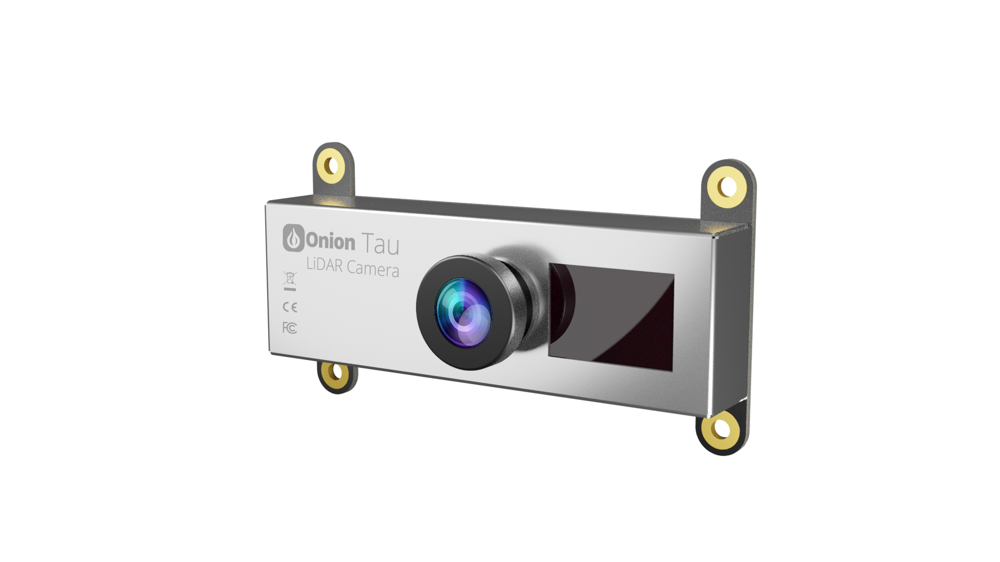

# tau-lidar-common
Common library for Onion Tau LiDAR Camera



## Main Features

TODO: add very brief overview of the main features of the library

## Installation & Supported Versions

Install using pip on the command line:

```
python -m pip install TauLidarCommon
```

Supports Python 3.6.1+

## API Reference & Documentation

Documentation & API reference can be found online: TODO

## Contributing to Development

See the [development document](DEVELOPMENT.md) for instructions on local development.

More info on contributing coming soon!
